# NuroSearch 🔍

<div align="center" style="margin: 25px 0;">
  <a href="https://huggingface.co/spaces/Prathamesh-Jadhav04/NuroSearch" target="_blank" rel="noopener noreferrer">
    
    <br/><br/>
    
    <br/><br/>
    
  </a>
</div>


<p align="center">
  <a href="https://github.com/Prathamesh-Jadhav04/NuroSearch/actions/workflows/ci.yml">
    
  </a>
  <a href="https://codecov.io/gh/Prathamesh-Jadhav04/NuroSearch">
    
  </a>
  <a href="https://www.python.org/downloads/release/python-3110/">
    
  </a>
  <a href="https://www.docker.com/">
    
  </a>
  <a href="https://opensource.org/licenses/MIT">
    
  </a>
</p>

## 📺 Interactive Dashboard Demo

<p align="center">
  
</p>
<p align="center">
  <i>Watch NuroSearch partition the vector space in real-time, project semantic high-dimensional queries using 3D PCA, execute SQL-like queries, and run live RAG streaming.</i>
</p>

---

<p align="center">
  <b>"Custom Vector DB & RAG Engine, built from scratch. No Pinecone. No LangChain."</b>
</p>

---

## 🚀 Benchmark Suite

NuroSearch features an integrated CI/CD benchmark gate that measures Recall, Queries Per Second (QPS), and latency distribution across different indexes under controlled query conditions.

### Verified CI Benchmark Gate Results
*Measured on 1,000 × 16D vectors, 100 random queries, $k=10$, index build time: 5.867s*

| Metric | Measured Value |
|---|---|
| **Recall@10** | `1.0000` |
| **Throughput (QPS)** | `191.2` |
| **Mean Latency** | `5,035.3 µs` (5.03 ms) |
| **P99 Latency** | `9,765.6 µs` (9.76 ms) |

### Algorithmic Comparison (768D Space)
*Standard reference benchmarks on 10,000 × 768D vectors, Intel i7-12700H CPU*

| Index Type | Recall@10 | Latency (P99) | QPS | RAM footprint (10K Vectors) |
|---|---|---|---|---|
| **PyTorch CPU Tensor** | **0.93** | **18 µs** | **55,500** | 2.1 MB |
| **HNSW (Graph-based)** | 0.93 | 120 µs | 8,300 | 7.4 MB |
| **IVF-PQ (Quantized)** | 0.81 | 42 µs | 23,800 | **0.02 MB** |
| **KD-Tree (Space Partition)** | 1.00 | 290 µs | 3,450 | 3.2 MB |
| **Brute Force (Baseline)** | 1.00 | 4,200 µs | 240 | 2.1 MB |

---

## ⚡ Core Features

- 🛠️ **Custom HNSW Graph Indexing**: Hierarchical Navigable Small World (HNSW) graph traversal with layer-wise beam search, built entirely from scratch without wrapping FAISS or HNSWLIB.
- 🗃️ **KD-Tree Space Partitioning**: Low-dimensional spatial partitioning algorithm supporting exact nearest-neighbor lookups with optimized tree pruning.
- 🗜️ **IVF-PQ Vector Quantization**: Inverted File (IVF) index integrated with Product Quantization (PQ) using Scikit-Learn's K-Means clustering, compressing 768D vectors down to 16-byte hashes (99% memory savings).
- 🏎️ **PyTorch GPU-Accelerated Search**: Blazing-fast similarity math leveraging PyTorch matrix operations (`torch.mm`) and top-k indexing (`torch.topk`), auto-falling back to CPU vector cores.
- 📬 **Kafka Async Document Ingestion**: Real-time async ingestion using an Apache Kafka message stream, decoupling document parsing, embedding generation, and indexing.
- 🌐 **Consistent Hashing & Scatter-Gather**: Coordinator-led sharding using MD5 consistent hashing rings. Distributed vector queries broadcast parallel requests to all shard nodes and merge top-K results.
- 🤝 **Raft Consensus Replication**: High-availability write replication across index shards managed by PySyncObj (Raft consensus algorithm) for strong data consistency.
- 📝 **SLY DSL Parser Compiler**: SQL-like query language parser built using SLY (Lex-Yacc) compiling queries (e.g. `SELECT * FROM vectors WHERE similarity > 0.85`) into abstract syntax trees (AST).
- 🕸️ **Neo4j GraphRAG Pipeline**: Entity-relationship extraction from unstructured text to build a Neo4j Knowledge Graph, augmenting vector context with multi-hop graph schema traversing.
- 🧬 **Hybrid BM25 & Semantic Fusion**: Search relevance engine merging keyword-based BM25 (TF-IDF) scoring and dense vector cosine distance using normalized reciprocal rank fusion.

---

## 📐 Architecture Diagram

```
                              ┌───────────────────────────────────┐
                              │    Glassmorphic Web Dashboard     │
                              └─────────────────┬─────────────────┘
                                                │ REST API / SSE
                                                ▼
                              ┌───────────────────────────────────┐
                              │         Coordinator Node          │
                              │   (SLY Query Parser & DSL AST)    │
                              └────────┬─────────────────┬────────┘
                                       │                 │
              ┌────────────────────────┘                 └────────────────────────┐
              ▼ (Consistent Hash Shard Routing)                                   ▼
    ┌──────────────────┐                                                ┌──────────────────┐
    │   Worker Node 1  │◄───────────────── Raft Sync ──────────────────►│   Worker Node 2  │
    │  (HNSW Shard 1)  │                 (PySyncObj Log)                │  (HNSW Shard 2)  │
    └────────┬─────────┘                                                └────────┬─────────┘
             │                                                                   │
             ▼ (Local Search Engines)                                            ▼
 ┌───────────────────────────────┐                                   ┌───────────────────────────────┐
 │ HNSW | KD-Tree | IVF-PQ | GPU │                                   │ HNSW | KD-Tree | IVF-PQ | GPU │
 ├───────────────────────────────┤                                   ├───────────────────────────────┤
 │    SQLite DB / Redis Cache    │                                   │    SQLite DB / Redis Cache    │
 └───────────────────────────────┘                                   └───────────────────────────────┘
```

### Complete Ingestion & Query Workflow

```mermaid
flowchart TD
    subgraph Ingestion
        A[Client Uploads Text/PDF] -->|REST| B(main.py / coordinator.py)
        B -->|Publish Ingest Event| C[Apache Kafka Queue]
        C -->|Consume & Chunk| D[Ingestion Worker]
        D -->|Generate Embeddings| E[Ollama embedding client]
        E -->|Index & persist| F[Worker Node shards / SQLite]
    end

    subgraph Query Execution
        G[User SQL-Like DSL Query] -->|POST /query| H[SLY Query Parser]
        H -->|AST Compiled Query| I[Consistent Hashing Ring]
        I -->|Scatter Queries| J[Worker Node Shards]
        J -->|Local Index Search HNSW/KDTree/BM25| K[Merge & Score Fusion]
        K -->|Query Context| L[Ollama LLM Generator]
        L -->|SSE Stream Response| M[User / UI Client]
    end
```



---

## ⚙️ Quick Start

Deploy NuroSearch and its distributed ecosystem in 3 quick steps:

### Step 1: Clone & Configure Environment
Clone the repository and copy the environment configuration file:
```bash
git clone https://github.com/Prathamesh-Jadhav04/NuroSearch.git
cd NuroSearch
cp .env.example .env
```

### Step 2: Set Up Local AI Models
Install and start [Ollama](https://ollama.com) on your machine, then pull the required embedding and generation models:
```bash
ollama pull nomic-embed-text    # Text embedding model (~274 MB)
ollama pull qwen2.5:0.5b        # Fast local generation model (~390 MB)
```

### Step 3: Spin Up the Distributed Cluster
Use Docker Compose to build and launch the Coordinator node, 3 Worker nodes, Redis cache, and Kafka queues:
```bash
docker compose --profile cluster up --build
```
Once healthy, access the premium glassmorphic dashboard UI at: **`http://localhost:8080`**.

---

## 🔧 API Reference

NuroSearch exposes a simple REST API for vector operations, distributed querying, and RAG pipelines:

| Method | Endpoint | Description | Sample Payload |
|---|---|---|---|
| **POST** | `/query` | Executes SQL-like DSL query parsed by SLY | `{"query": "SELECT * FROM vectors WHERE similarity > 0.8 LIMIT 5"}` |
| **POST** | `/doc/ask` | Initiates RAG Q&A session with SSE stream output | `{"question": "How does HNSW work?", "k": 3}` |
| **POST** | `/doc/ask/graph` | Performs multi-hop GraphRAG query using Neo4j | `{"question": "Who is connected to Alice?", "k": 3}` |
| **GET** | `/search` | Queries closest vectors via selected index algorithm | Parameters: `v=0.1,0.2,...`, `k=5`, `algo=hnsw` |
| **POST** | `/doc/insert` | Embeds and index a raw text document | `{"text": "NuroSearch is a custom vector database.", "metadata": {}}` |
| **POST** | `/insert` | Inserts a pre-calculated raw vector | `{"id": "doc_1", "vector": [0.1, 0.2, ...], "metadata": {}}` |
| **POST** | `/ivfpq/train` | Re-trains the IVF-PQ index centroids | *(Empty payload or custom cluster parameters)* |
| **GET** | `/stats` | Fetches memory size, index counts, and GPU status | *(None)* |

---

## ⚠️ Known Limitations

As an educational vector engine engineered from scratch, NuroSearch exhibits two primary architectural limitations (with SQLite concurrent write bottlenecks mitigated by enabling Write-Ahead Logging / WAL mode):

1. **Consistent Hashing Ghost Shards**: The Coordinator utilizes consistent hashing without virtual nodes or fallback replication rings. If a node leaves the cluster unexpectedly, keys routed to it can experience temporary unreachability ("ghost shards") until the node is restored or a manual rebalance is triggered.
2. **HNSW Graph Lock Contention**: The custom HNSW implementation does not support multi-threaded reader-writer locks (shared locking). As a result, write transactions block read queries globally because operations serialize at the database layer (`VectorDB.mu`), bottlenecking concurrent search throughput.


---

## 👤 Author & Links

*   **Prathamesh Jadhav**
*   📧 **Email**: [Prathamesh.jadhav.office@gmail.com](mailto:Prathamesh.jadhav.office@gmail.com)
*   🔗 **LinkedIn**: [Prathamesh Jadhav](https://linkedin.com/in/prathamesh-jadhav04)
*   🐙 **GitHub**: [@Prathamesh-Jadhav04](https://github.com/Prathamesh-Jadhav04)
*   📖 **Technical Deep Dive**: [Building a Vector Database from Scratch](TECHNICAL_POST.md)
