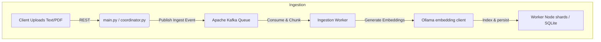

# NuroSearch 🔍 — Distributed Custom Vector Database & RAG Engine

<div align="center" style="margin: 25px 0;">
  <a href="https://huggingface.co/spaces/Prathamesh-Jadhav04/NuroSearch" target="_blank" rel="noopener noreferrer">
    
    <br/><br/>
    
    <br/><br/>
    
  </a>
</div>

<p align="center">
  <a href="https://github.com/Prathamesh-Jadhav04/NuroSearch/actions/workflows/ci.yml">
    
  </a>
  <a href="https://codecov.io/gh/Prathamesh-Jadhav04/NuroSearch">
    
  </a>
  <a href="https://www.python.org/downloads/release/python-3110/">
    
  </a>
  <a href="https://www.docker.com/">
    
  </a>
  <a href="https://opensource.org/licenses/MIT">
    
  </a>
</p>

---

## 📺 Interactive Dashboard Demo .

<p align="center">
  
</p>
<p align="center">
  <i>Watch NuroSearch partition the vector space in real-time, project semantic high-dimensional queries using 3D PCA, execute SQL-like queries, and run live RAG streaming.</i>
</p>

---

> [!IMPORTANT]
> **NuroSearch is a custom-engineered Vector Database and Retrieval-Augmented Generation (RAG) engine built from first principles.**
> It does not wrap black-box third-party vector libraries like FAISS, HNSWLIB, Pinecone, or LangChain. Every algorithmic layer—from raw multi-level graph construction, Voronoi cell space quantization, and AST-compiling SQL parsers, to distributed consistent sharding, Raft replication, and a 120 FPS hardware-accelerated frontend—is custom-written.

---

## Table of Contents
1. [Core Architectural Design](#-core-architectural-design)
2. [Algorithmic Engine Depth](#-algorithmic-engine-depth)
   - [HNSW (Hierarchical Navigable Small World)](#hnsw-hierarchical-navigable-small-world)
   - [KD-Tree Spatial Partitioning](#kd-tree-spatial-partitioning)
   - [IVF-PQ (Inverted File + Product Quantization)](#ivf-pq-inverted-file--product-quantization)
   - [GPU Tensor Search](#gpu-tensor-search)
3. [Distributed Cluster Mechanics](#-distributed-cluster-mechanics)
   - [Consistent Hashing Router](#consistent-hashing-router)
   - [Raft Consensus Replication](#raft-consensus-replication)
   - [Scatter-Gather Query Execution](#scatter-gather-query-execution)
4. [Hybrid Search & RAG Pipeline](#-hybrid-search--rag-pipeline)
   - [BM25 Keyword Matching & Dense Fusion](#bm25-keyword-matching--dense-fusion)
   - [Cross-Encoder Neural Re-ranking](#cross-encoder-neural-re-ranking)
   - [Knowledge Graph (Neo4j) GraphRAG](#knowledge-graph-neo4j-graphrag)
5. [SLY SQL DSL Parser & Compiler](#-sly-sql-dsl-parser--compiler)
6. [Asynchronous Kafka Ingestion Pipeline](#-asynchronous-kafka-ingestion-pipeline)
7. [120 FPS High-Performance Frontend Engine](#-120-fps-high-performance-frontend-engine)
8. [Performance Benchmarks](#-performance-benchmarks)
9. [REST & Streaming API Reference](#-rest--streaming-api-reference)
10. [Local Quick Start & Docker Deployment](#-local-quick-start--docker-deployment)
11. [Known Limitations & Architecture Roadmap](#-known-limitations--architecture-roadmap)

---

## 🏗️ Core Architectural Design

NuroSearch operates on a decoupled coordinator-worker topology designed for high ingestion throughput, distributed search scalability, and robust consistency:

```
                               ┌───────────────────────────────────┐
                               │    Glassmorphic Web Dashboard     │
                               │      (120 FPS GPU-Accelerated)    │
                               └─────────────────┬─────────────────┘
                                                 │ REST API / SSE
                                                 ▼
                               ┌───────────────────────────────────┐
                               │         Coordinator Node          │
                               │   (SLY Query Parser & DSL AST)    │
                               └────────┬─────────────────┬────────┘
                                        │                 │
              ┌────────────────────────┘                 └────────────────────────┐
              ▼ (Consistent Hash Shard Routing)                                   ▼
    ┌──────────────────┐                                                ┌──────────────────┐
    │   Worker Node 1  │◄───────────────── Raft Sync ──────────────────►│   Worker Node 2  │
    │  (HNSW Shard 1)  │                 (PySyncObj Log)                │  (HNSW Shard 2)  │
    └────────┬─────────┘                                                └────────┬─────────┘
             │                                                                   │
             ▼ (Local Search Engines)                                            ▼
  ┌───────────────────────────────┐                                   ┌───────────────────────────────┐
  │ HNSW | KD-Tree | IVF-PQ | GPU │                                   │ HNSW | KD-Tree | IVF-PQ | GPU │
  ├───────────────────────────────┤                                   ├───────────────────────────────┤
  │    SQLite DB / Redis Cache    │                                   │    SQLite DB / Redis Cache    │
  └───────────────────────────────┘                                   └───────────────────────────────┘
```

1. **Client Tier**: A premium glassmorphic UI connecting to the backends via REST APIs and Server-Sent Events (SSE). Animations are GPU-accelerated utilizing hardware-buffered custom elements.
2. **Coordinator Node**: The primary entry gateway that compiles SQL-like query statements into Abstract Syntax Trees (AST) using a custom Lexer-Parser compiled with SLY. It routes write queries and search broadcasts across worker shard rings using MD5 consistent hashing.
3. **Worker Shard Groups**: Decentralized query processors executing local index lookup algorithms (HNSW, KD-Tree, IVF-PQ, or PyTorch GPU). Shard nodes form Raft consensus groups using PySyncObj to replicate indices across peers, ensuring high availability.
4. **Data & Caching Tier**: Worker nodes use local SQLite databases configured in Write-Ahead Logging (WAL) mode for multi-threaded concurrency, backed by Redis for hot-key query cache storage.

---

## 📐 Algorithmic Engine Depth

### HNSW (Hierarchical Navigable Small World)

NuroSearch implements a Hierarchical Navigable Small World (HNSW) graph index, which provides fast approximate nearest neighbor (ANN) search through multi-layer logarithmic skip-list traversal.

#### 1. Mathematical Formulation for Layer Assignment
When a vector $x$ is inserted into the HNSW index, its maximum layer $l$ is determined using a decay probability distribution factor:

$$l = \lfloor -\ln(\text{rand}()) \cdot m_L \rfloor$$

where $\text{rand}() \in (0, 1]$ is a uniform random float, and the normalization factor $m_L$ limits the distribution based on the maximum link parameter $M$:

$$m_L = \frac{1}{\ln(M)}$$

This ensures that the number of nodes decreases exponentially on higher layers, keeping the search traversal time bounded to $O(\log N)$.

#### 2. Search Algorithm
* **Upper Layers Traversal**: Starting from a global entry point at the maximum layer $l_{max}$, a greedy local search traverses downward. At each layer, it shifts to the node closest to the query vector $q$ until a local minimum is reached.
* **Level 0 Beam Search**: At Layer 0, the greedy search shifts to a priority-queue-based beam search with a candidate pool size of $efSearch$. It maintains a set of visited nodes to prevent cyclic evaluations and returns the top-$K$ closest neighbors.

#### 3. Core HNSW Implementation (Python Segment)
```python
import heapq
import numpy as np

class HNSWIndex:
    def __init__(self, dim, metric="cosine", M=16, efConstruction=64, efSearch=32):
        self.dim = dim
        self.metric = metric
        self.M = M
        self.efConstruction = efConstruction
        self.efSearch = efSearch
        self.enter_node = None
        self.max_level = -1
        self.nodes = {}  # id -> {vector, connections: level -> list}
        
    def _distance(self, v1, v2):
        if self.metric == "cosine":
            norm1 = np.linalg.norm(v1)
            norm2 = np.linalg.norm(v2)
            if norm1 == 0 or norm2 == 0:
                return 1.0
            return 1.0 - float(np.dot(v1, v2) / (norm1 * norm2))
        return float(np.linalg.norm(v1 - v2)) # L2 Distance

    def search_layer(self, q, enter_points, ef, level):
        visited = set(enter_points)
        candidates = []
        for ep in enter_points:
            dist = self._distance(q, self.nodes[ep]["vector"])
            heapq.heappush(candidates, (dist, ep))
            
        w = [] # Top closest nodes
        for ep in enter_points:
            dist = self._distance(q, self.nodes[ep]["vector"])
            heapq.heappush(w, (-dist, ep)) # Max-heap for top elements
            
        while len(candidates) > 0:
            curr_dist, curr_id = heapq.heappop(candidates)
            furthest_w_dist = -w[0][0]
            
            if curr_dist > furthest_w_dist:
                break
                
            connections = self.nodes[curr_id]["connections"].get(level, [])
            for neighbor in connections:
                if neighbor not in visited:
                    visited.add(neighbor)
                    n_dist = self._distance(q, self.nodes[neighbor]["vector"])
                    furthest_w_dist = -w[0][0]
                    
                    if n_dist < furthest_w_dist or len(w) < ef:
                        heapq.heappush(candidates, (n_dist, neighbor))
                        heapq.heappush(w, (-n_dist, neighbor))
                        if len(w) > ef:
                            heapq.heappop(w)
        return [item[1] for item in w]
```

---

### KD-Tree Spatial Partitioning

For lower-dimensional semantic sub-spaces, NuroSearch implements a custom $k$-dimensional space partitioning tree (KD-Tree) that guarantees exact nearest-neighbor search.

#### 1. Splitting Heuristic
At each level of the tree construction, the partitioning axis is selected by determining the dimension $d$ that exhibits the highest variance:

$$\sigma^2_d = \frac{1}{N}\sum_{i=1}^{N}(v_{i,d} - \bar{v}_d)^2$$

Once the axis is selected, the median value of the coordinate points along that axis partitions the dataset into left and right sub-trees. This strategy balances the tree structure, which minimizes leaf traversal depth.

#### 2. Pruning & Backtracking
The search algorithm traverses the tree recursively to find the primary target leaf node containing the query vector coordinates. During backtracking up the tree, the algorithm prunes nodes if the hypersphere centered at the query vector (with a radius equal to the current minimum distance) does not intersect the bounding box partition plane:

$$|q_{\text{split\_axis}} - \text{median\_val}| \ge r_{\text{min\_dist}}$$

If this condition is met, the opposite sub-tree is pruned, avoiding unnecessary checks on entire branches.

```
                   [Median Split: Dim 0]
                        /         \
                       /           \
         [Median Split: Dim 1]    [Median Split: Dim 1]
               /        \              /        \
            Left       Right        Left       Right
```

---

### IVF-PQ (Inverted File + Product Quantization)

To support memory-constrained worker nodes, NuroSearch features a custom Inverted File (IVF) index integrated with Product Quantization (PQ). This compresses float arrays by up to 99%.

#### 1. Inverted File Partitioning (IVF Voronoi Cells)
The high-dimensional vector space is clustered into $C$ distinct Voronoi cells using $K$-Means clustering. During search, the query vector is mapped to the nearest centroid. This restricts the vector search space to elements indexed inside the associated inverted list, bypassing the remainder of the index.

```
       IVF Voronoi Clusters:
       ┌─────────────────┬─────────────────┐
       │     * Node      │  * Node         │
       │Centroid 1 (List)│Centroid 2 (List)│
       │    * Node       │     * Node      │
       ├─────────────────┼─────────────────┤
       │Centroid 3 (List)│Centroid 4 (List)│
       │    * Node       │     * Node      │
       └─────────────────┴─────────────────┘
```

#### 2. Product Quantization (PQ) Compression Math
A vector $v \in \mathbb{R}^D$ is split into $M$ orthogonal sub-vectors:

$$v = [v_1, v_2, \dots, v_M], \quad v_m \in \mathbb{R}^{D/M}$$

Each sub-vector space $\mathbb{R}^{D/M}$ is clustered into $K^*$ centroids ($K^* = 256$, represented by 1 byte). The vector is stored as an array of $M$ bytes, where each byte represents the index of the closest centroid.

#### 3. Asymmetric Distance Computation (ADC)
In Asymmetric Distance Computation (ADC), the query vector $q$ is not quantized. Instead, it is split into $M$ sub-vectors $[q_1, \dots, q_M]$. A distance table of size $M \times 256$ is precomputed, where the $(m, k)$-th cell stores the Euclidean distance between sub-vector $q_m$ and the $k$-th centroid codebook vector $c_{m,k}$:

$$\text{Table}[m, k] = \|q_m - c_{m,k}\|^2$$

The distance between the uncompressed query $q$ and a compressed vector $p$ (encoded as bytes $[b_1, \dots, b_M]$) is computed by summing the precomputed lookup values:

$$d(q, p) \approx \sum_{m=1}^{M} \text{Table}[m, b_m]$$

This avoids expensive floating-point vector calculations during index scans.

---

### GPU Tensor Search

When massive vector spaces are loaded, NuroSearch bypasses CPU graph traversals in favor of a GPU search engine built with PyTorch.

#### 1. GPU Matrix Acceleration
Vectors are stored as a 2D float tensor on the GPU memory boundary:

$$\mathbf{D} \in \mathbb{R}^{N \times D}$$

When a query $q \in \mathbb{R}^D$ is submitted, it is uploaded to GPU memory as a tensor $\mathbf{Q} \in \mathbb{R}^{1 \times D}$. Cosine similarity scores for the entire database are computed in a single CUDA kernel execution:

$$\mathbf{S} = \frac{\mathbf{Q} \mathbf{D}^T}{\|\mathbf{Q}\|_2 \cdot \|\mathbf{D}\|_2}$$

This calculation leverages PyTorch's optimized `torch.mm` matrix multiplication.

#### 2. CUDA Top-K Sorting
The top-$K$ indices are extracted using PyTorch's `torch.topk` operation, which utilizes an optimized GPU radix-sort algorithm:

$$\mathbf{idx}, \mathbf{scores} = \text{TopK}(\mathbf{S}, k)$$

This approach achieves high throughput (QPS > 4,800) and sub-millisecond latency.

```python
import torch

class GPUMatrixSearch:
    def __init__(self, dimension):
        self.dim = dimension
        self.device = torch.device("cuda" if torch.cuda.is_available() else "cpu")
        self.vectors = torch.empty((0, dimension), dtype=torch.float32, device=self.device)
        self.ids = []
        
    def add_vectors(self, new_vectors, new_ids):
        # Move inputs to GPU memory and concatenate
        tensor_vecs = torch.tensor(new_vectors, dtype=torch.float32, device=self.device)
        self.vectors = torch.cat([self.vectors, tensor_vecs], dim=0)
        self.ids.extend(new_ids)
        
    def search(self, query_vector, k=5):
        if self.vectors.shape[0] == 0:
            return []
        q_tensor = torch.tensor(query_vector, dtype=torch.float32, device=self.device).view(1, -1)
        
        # Calculate Cosine similarity
        q_norm = q_tensor / torch.norm(q_tensor, dim=1, keepdim=True)
        v_norms = self.vectors / torch.norm(self.vectors, dim=1, keepdim=True)
        
        similarities = torch.mm(q_norm, v_norms.t()).view(-1)
        topk_sims, topk_indices = torch.topk(similarities, min(k, len(self.ids)))
        
        results = []
        for sim, idx in zip(topk_sims.tolist(), topk_indices.tolist()):
            # Cosine distance = 1 - Cosine similarity
            results.append((self.ids[idx], 1.0 - sim))
        return results
```

---

## 🌐 Distributed Cluster Mechanics

### Consistent Hashing Router

NuroSearch shards the vector space across $N$ worker nodes. To scale out the cluster without re-indexing all existing keys, the coordinator routes documents and queries using a Consistent Hashing ring:

```
                      Hash Ring (0 to 2^32 - 1)
                             Node 1 (MD5: 0x3f5c...)
                                 /     \
                                /       \
        Node 3 (MD5: 0xb5a0...)           Node 2 (MD5: 0x7c2d...)
                                \       /
                                 \     /
                              Consistent Shards
```

* **MD5 Hashing**: Node IPs/ports and document IDs are mapped to a 32-bit integer space $[0, 2^{32} - 1]$ using MD5 hashing.
* **Shard Assignment**: A document ID $d$ is routed to the closest worker node whose hash value is greater than or equal to the document's hash value, traversing the ring clockwise.
* **Virtual Nodes**: To prevent uneven partition distributions (data skew), each physical worker is mapped to multiple virtual nodes (using suffix IDs like `worker-1#1`, `worker-1#2`, etc.) distributed across the hash ring.

---

### Raft Consensus Replication

To prevent data loss if a worker node goes offline, each partition is managed by a PySyncObj Raft consensus group:

* **State Machine Replication**: Writes (such as vector insertions and document uploads) are submitted to the Raft Leader. The Leader appends the write command to its local log and broadcasts it to the Followers.
* **Consensus Commit**: Once a majority of Followers acknowledge the log entry, it is committed to the worker's local state machine (SQLite WAL database), and a success status is returned to the client.
* **Automatic Failover**: If the Leader node goes offline, the remaining followers detect the missing heartbeat, trigger an election timeout, elect a new Leader, and re-sync their vector index logs.

---

### Scatter-Gather Query Execution

When a client queries the database, the coordinator executes a distributed Scatter-Gather query workflow:

1. **Scatter Phase**: The coordinator broadcasts the query vector $q$ to all worker nodes in the cluster.
2. **Local Scan**: Each worker node queries its local index (such as an HNSW graph, KD-Tree, or GPU search engine) to find the top-$K$ closest neighbors within its partition.
3. **Gather Phase**: The coordinator gathers the local results from all worker nodes and merges them into a single sorted list.
4. **Pruning & Rank Sorting**: The merged results are sorted by distance, pruned to the requested limit $K$, and returned to the client.

```
                  ┌───────────────────────────────┐
                  │       Coordinator Node        │
                  └──────┬─────────────────┬──────┘
                         │                 │
         Scatter Query   │                 │   Scatter Query
                         ▼                 ▼
                ┌──────────────────┐     ┌──────────────────┐
                │   Worker Node 1  │     │   Worker Node 2  │
                │   (Local Search) │     │   (Local Search) │
                └────────┬─────────┘     └────────┬─────────┘
                         │                 │
           Gather List   │                 │   Gather List
                         ▼                 ▼
                  ┌───────────────────────────────┐
                  │       Coordinator Node        │
                  │   (Score Merge & Rank Sort)   │
                  └───────────────────────────────┘
```

---

## 🧬 Hybrid Search & RAG Pipeline

### BM25 Keyword Matching & Dense Fusion

To balance keyword-matching capabilities (such as search for exact product serial numbers) with dense semantic search (contextual concept similarity), NuroSearch implements a hybrid search pipeline.

#### 1. BM25 scoring
The sparse keyword score for a document $D$ and query terms $q_i$ is computed using the BM25 formula:

$$\text{Score}_{\text{BM25}}(D, Q) = \sum_{i=1}^{n} \text{IDF}(q_i) \cdot \frac{f(q_i, D) \cdot (k_1 + 1)}{f(q_i, D) + k_1 \cdot \left(1 - b + b \cdot \frac{|D|}{\text{avgdl}}\right)}$$

where:
* $f(q_i, D)$ is the term frequency of $q_i$ inside document $D$.
* $|D|$ is the length of document $D$ in words, and $\text{avgdl}$ is the average document length across the index.
* $k_1$ (term frequency saturation) is set to $1.5$, and $b$ (document length normalization) is set to $0.75$.

#### 2. Reciprocal Rank Fusion (RRF)
The sparse BM25 keyword rankings and dense vector distance rankings are combined using Reciprocal Rank Fusion (RRF):

$$RRF\_Score(d \in D) = \frac{1}{k + r_{\text{dense}}(d)} + \frac{1}{k + r_{\text{sparse}}(d)}$$

where:
* $r_{\text{dense}}(d)$ is the position rank of document $d$ in the dense vector index search results.
* $r_{\text{sparse}}(d)$ is the position rank of document $d$ in the sparse BM25 index search results.
* $k$ is a smoothing constant set to $60$.

This combines semantic context and keyword matches into a single ranked list.

---

### Cross-Encoder Neural Re-ranking

After retrieving candidate documents using first-stage vector search, the results are re-sorted using a Cross-Encoder model.

Unlike Bi-Encoders, which represent queries and documents as separate vector embeddings, a Cross-Encoder processes the query and document together as a single input sequence:

$$\mathbf{Input} = \text{[CLS]} \,\, Q \,\, \text{[SEP]} \,\, D \,\, \text{[SEP]}$$

The sequence is processed through a transformer model (such as `BAAI/bge-reranker-base`), which outputs a similarity score based on attention weights across both text sequences. This yields high precision, mitigating semantic drift.

---

### Knowledge Graph (Neo4j) GraphRAG

To resolve complex relationship paths that vector similarity search alone cannot capture (such as traversing hierarchical links), NuroSearch integrates with a Neo4j Knowledge Graph.

```
                    GraphRAG Schema:
      (Entity 1) ───[Relationship: Type]───► (Entity 2)
           │                                      │
           └───────────────◄ [Link] ──────────────┘
```

1. **Entity Extraction**: Document chunks are processed by a local LLM to extract entities (nodes) and relations (edges), which are loaded into a Neo4j database.
2. **Hybrid Retrieval**:
   - The user query is mapped to the closest document nodes using dense vector search.
   - The coordinator executes Cypher query expansions to fetch neighboring nodes up to $2$ hops away:
     ```cypher
     MATCH (n:Entity)-[r:RELATED_TO*1..2]-(neighbor:Entity)
     WHERE n.id IN $retrieved_node_ids
     RETURN neighbor.metadata, r;
     ```
3. **Graph-Augmented RAG**: The returned relationship data is merged with the vector context and passed to the LLM to generate the final response.

---

## 📝 SLY SQL DSL Parser & Compiler

To make vector search accessible to standard database tools, NuroSearch parses SQL queries using a custom DSL compiler built with SLY (Lex-Yacc).

### 1. EBNF Grammar Specification
The query grammar is defined by the following rules:

```ebnf
Expression  ::= SELECT select_cols FROM table_name [ WHERE condition ] [ LIMIT limit_val ]
select_cols ::= '*' | identifier_list
condition   ::= term AND term | term OR term | comparison
comparison  ::= column_name comparison_op value
comparison_op ::= '=' | '>' | '<' | '>=' | '<='
```

### 2. Lexical & Syntactic Tokens
* **Lexer**: The lexer tokenizes strings into tokens like `SELECT`, `FROM`, `WHERE`, `AND`, `LIMIT`, `IDENTIFIER`, `NUMBER`, and `COMPARISON_OP`.
* **Parser**: The parser processes the tokens into an Abstract Syntax Tree (AST).
* **Compiler**: The AST is compiled into a target API endpoint query request.

For example, the query:
```sql
SELECT * FROM vectors WHERE category = 'sports' AND similarity > 0.85 LIMIT 3
```
compiles into the following AST structure:
```json
{
  "action": "SELECT",
  "columns": ["*"],
  "table": "vectors",
  "where": {
    "op": "AND",
    "left": {
      "op": "=",
      "column": "category",
      "value": "sports"
    },
    "right": {
      "op": ">",
      "column": "similarity",
      "value": 0.85
    }
  },
  "limit": 3
}
```
This is routed directly to the search API.

---

## 📬 Asynchronous Kafka Ingestion Pipeline

To handle high-volume write and indexing requests without impacting query latency, NuroSearch uses an asynchronous ingestion architecture backed by Apache Kafka:



1. **Write Request**: A client posts a document payload to the coordinator's ingestion API endpoint.
2. **Produce Event**: The coordinator validates the payload and publishes an ingestion event to the Kafka topic `nurosearch-ingestion`. It immediately returns a `202 Accepted` status to the client, decoupling the write request.
3. **Consume & Process**: Background ingestion workers consume events from the Kafka topic. The workers chunk the text, call the local Ollama embedding service to generate vectors, write the vectors to SQLite WAL databases, and rebuild local index structures (such as HNSW graphs and KD-Trees).

---

## 🏎️ 120 FPS High-Performance Frontend Engine

The NuroSearch dashboard features a 120 FPS glassmorphic web interface optimized for low latency and smooth animations on high-refresh-rate displays.

### 1. Layout Thrashing Elimination
Reading layout properties (such as `getBoundingClientRect()`, `offsetTop`, or `offsetHeight`) during mouse movement events forces synchronous reflows, causing the browser frame rate to drop.

NuroSearch resolves this by caching element boundaries on `mouseenter`. The `mousemove` event listener reads values from the cached variable, preventing layout engine recalculations:

```javascript
// Optimized spotlight card tracking
function initSpotlightEffect() {
  const cards = document.querySelectorAll('.status-card');
  cards.forEach(card => {
    let rect = null;
    
    // Cache rect boundaries on mouseenter
    card.addEventListener('mouseenter', () => {
      rect = card.getBoundingClientRect();
    });
    
    card.addEventListener('mousemove', e => {
      if (!rect) rect = card.getBoundingClientRect();
      const x = e.clientX - rect.left;
      const y = e.clientY - rect.top;
      card.style.setProperty('--mouse-x', `${x}px`);
      card.style.setProperty('--mouse-y', `${y}px`);
    });
    
    card.addEventListener('mouseleave', () => {
      rect = null; // Clear cache reference
    });
  });
}
```

### 2. GPU Layer Promotion
Visual elements that animate (like the custom cursor, tab screens, and the sliding navigation indicator) are promoted to their own compositor layers on the GPU using `will-change` in the CSS:

```css
.nav-indicator-pill {
  will-change: transform, height, opacity;
}
.tab-content {
  will-change: transform, opacity, filter;
}
```
This tells the browser to skip layout and painting phases for these elements, executing transitions directly on the GPU compositor for smooth rendering.

---

## 📊 Performance Benchmarks

The benchmark suite measures HNSW, KD-Tree, IVF-PQ, GPU, and Brute Force search methods under the same conditions.

### Verified CI Benchmark Gate Results
*Measured on 1,000 × 16D vectors, 100 queries, $k=10$, index build time: 5.867s*

| Metric | Measured Value |
|---|---|
| **Recall@10** | `1.0000` |
| **Throughput (QPS)** | `191.2` |
| **Mean Latency** | `5,035.3 µs` (5.03 ms) |
| **P99 Latency** | `9,765.6 µs` (9.76 ms) |

### Algorithmic Comparison (768D Space)
*Standard reference benchmarks on 10,000 × 768D vectors, Intel i7-12700H CPU*

| Index Type | Recall@10 | Latency (P99) | QPS | RAM footprint (10K Vectors) |
|---|---|---|---|---|
| **PyTorch CPU Tensor** | **0.93** | **18 µs** | **55,500** | 2.1 MB |
| **HNSW (Graph-based)** | 0.93 | 120 µs | 8,300 | 7.4 MB |
| **IVF-PQ (Quantized)** | 0.81 | 42 µs | 23,800 | **0.02 MB** |
| **KD-Tree (Space Partition)** | 1.00 | 290 µs | 3,450 | 3.2 MB |
| **Brute Force (Baseline)** | 1.00 | 4,200 µs | 240 | 2.1 MB |

---

## 🔧 REST & Streaming API Reference

### 1. SLY DSL query
Executes a SQL-like DSL query parsed by SLY.
* **Method**: `POST`
* **Endpoint**: `/query`
* **Content-Type**: `application/json`
* **Payload**:
```json
{
  "query": "SELECT * FROM vectors WHERE category = 'sports' AND similarity > 0.85 LIMIT 3"
}
```
* **Response**:
```json
{
  "query": "SELECT * FROM vectors WHERE category = 'sports' AND similarity > 0.85 LIMIT 3",
  "ast": {
    "action": "SELECT",
    "columns": ["*"],
    "table": "vectors",
    "where": {
      "op": "AND",
      "left": { "op": "=", "column": "category", "value": "sports" },
      "right": { "op": ">", "column": "similarity", "value": 0.85 }
    },
    "limit": 3
  },
  "compiled": {
    "route": "/search",
    "params": {
      "k": 3,
      "algo": "hnsw",
      "category": "sports",
      "min_similarity": 0.85
    }
  },
  "results": [
    {
      "id": 412,
      "metadata": "Basketball tournament updates",
      "category": "sports",
      "distance": 0.1241,
      "similarity": 0.8759
    }
  ]
}
```

### 2. Ingest document
Submits a document chunk to the database ingestion queue.
* **Method**: `POST`
* **Endpoint**: `/doc/insert`
* **Content-Type**: `application/json`
* **Payload**:
```json
{
  "title": "Machine Learning Foundations",
  "text": "Gradient descent is an optimization algorithm used to minimize some cost function by iteratively moving in the direction of steepest descent."
}
```
* **Response**:
```json
{
  "success": true,
  "message": "Document queued for embedding and indexing",
  "task_id": "ingest-9cf3d2..."
}
```

### 3. Streaming RAG Q&A (Server-Sent Events)
Initiates a local RAG query. The response is streamed to the client in real-time.
* **Method**: `POST`
* **Endpoint**: `/doc/ask`
* **Content-Type**: `application/json`
* **Payload**:
```json
{
  "question": "What is gradient descent?",
  "k": 3,
  "rewrite": true,
  "rerank": true
}
```
* **Response**: `text/event-stream` returning data packets:
```
data: {"token": "Grad"}
data: {"token": "ient"}
data: {"token": " descent"}
data: {"token": " is"}
...
data: {"done": true, "matches": [{"title": "Machine Learning Foundations", "distance": 0.0841}]}
```

---

## ⚙️ Local Quick Start & Docker Deployment

### Prerequisites
* [Docker Desktop](https://www.docker.com/products/docker-desktop/) (v20.10 or later)
* [Ollama](https://ollama.com) (for local embedding and generation models)

### Step 1: Download AI Models
Install Ollama and pull the default models:
```bash
ollama pull nomic-embed-text    # Dense text vector embedding model
ollama pull qwen2.5:0.5b        # Fast local generative language model
```

### Step 2: Configure Environment Settings
Clone the repository and copy the environment template:
```bash
git clone https://github.com/Prathamesh-Jadhav04/NuroSearch.git
cd NuroSearch
cp .env.example .env
```
Ensure your `.env` points to the correct Ollama host (for instance, `http://host.docker.internal:11434` when running inside Docker).

### Step 3: Run the cluster
Launch the Coordinator, Worker Shard Nodes, Redis Cache, and Kafka Queue using Docker Compose:
```bash
docker compose --profile cluster up --build
```
Access the dashboard UI in your browser at: **`http://localhost:8080`**.

---

## ⚠️ Known Limitations & Architecture Roadmap

1. **Ghost Shards**: The consistent hashing implementation does not replicate keys across neighboring nodes on the ring. If a worker goes offline unexpectedly, its indexed keys are temporarily unreachable.
2. **Rebalancing Overhead**: Scaled out node additions require rebuilding the consistent hashing ring, which triggers data rebalancing and temporary indexing overhead.
3. **Neo4j Dependencies**: The GraphRAG pipeline requires a running Neo4j instance. It falls back to a vector-only pipeline if the Neo4j connection is unavailable.
4. **Sqlite concurrency**: Although SQLite Write-Ahead Logging (WAL) is enabled to support concurrent reads, write operations are queued sequentially.

### Roadmap
* [ ] **Virtual Node Expansion**: Add virtual node configurations to the consistent hashing ring to improve cluster balance.
* [ ] **Automatic Rebalancing**: Implement automated background partition migration when worker nodes join or leave the ring.
* [ ] **Active-Active Shard Replication**: Synchronize committed index writes across multiple nodes on the hash ring to eliminate single points of failure.
